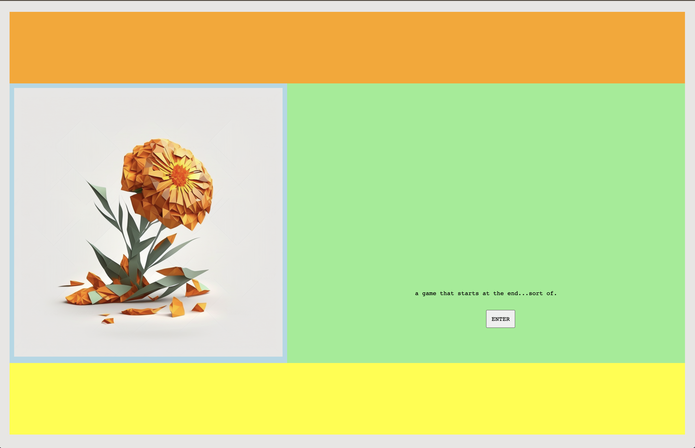

lol wait, i dont know how it happened but i completely read over the part where this assignment was supposed to be about new york!! my bad...

# how i built my HTML page # 
1. draw a sketch
2. figure out the wireframes/flexboxes
3. generate images
4. figure out the CSS :') 
5. put it all together (html and CSS) in VS code 

# inspiration, process documentation, struggles, references, and questions #

this assignment was to design and develop a website about New York using a strong grid drawn from [Swiss Poster Design](https://duckduckgo.com/?q=swiss+poster+design&t=ffab&iax=images&ia=images) examples. 

normally i am a MAXimalist with design and was excited to challenge myself with the minimal approach of this asignment. :')

my outline is below:

--- 

## functionality ##
- responsive to different screen sizes
- describes project with few images/words 
- enter button is functional
- title has animation

## design ##
- matches color palette 
- title font and style changes when user hovers over them 
- minimalist approach 
- imagery that represents the game aesthetic

## maintenance and support ## 
- CSS is prefixed to support all browsers!

## hosting ##
- source code and design is open source, hosted on github
- website is publicly accessible and deployed to glitch

---

here was my sketch! 

for the color palette, i chose these:

using midjourney, i was able to generate the low-poly rendering of a marigold below that also tied into the creation of some concept art for a unity project i started. >:)

to actually create the grid and flexboxes i read [this webpage](https://css-tricks.com/snippets/css/a-guide-to-flexbox/#aa-prefixing-flexbox) beginning to end to fully understand how to manipulate the css to do what i want and after hours and hours i finally figured it out!!! :') i also had to use different background colors for each flex box (that i later commented out) to help me visualize where the actual boxes were:

